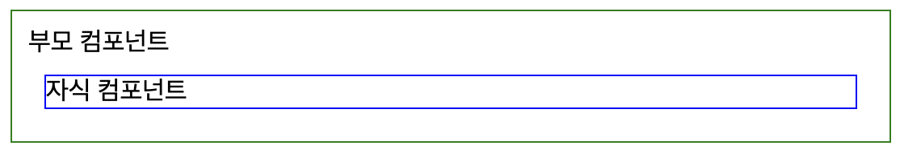
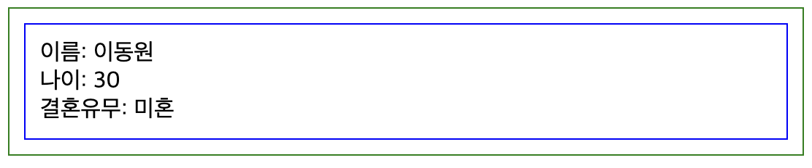
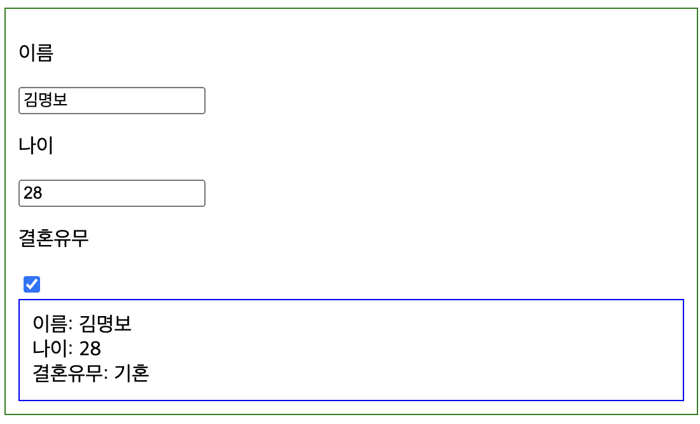

# React 기초 강의(2)
### Component, Tag, State, Props
\~ by tunalee

---

# State란?

- 컴포넌트 내에서 관리되는 동적인 데이터
- UI에 영향을 미치는 데이터
- State가 변경되면 컴포넌트가 다시 렌더링됨
- useState hook을 사용

---
```jsx
const [name, setName] = useState('')
const [age, setAge] = useState(0)
const [isMarried, setIsMarried] = useState(false)

const [data, setData] = useState({
    name: '',
    age: 0,
    isMarried: false
})

```
---
# 조건부 렌더링 (Conditional Rendering)

React에서 조건부 렌더링은 자바스크립트의 조건문을 사용해, 특정 조건에 따라 다른 UI를 렌더링하는 방식
```jsx
<div>
    {isMarried ? (<div>기혼</div>): (<div>미혼</div>)}
</div>
```

---

# State 예시 (Count)

```jsx
import React, { useState } from 'react';

function Counter() {
  const [count, setCount] = useState(0);

  return (
    <div>
      <p>현재 카운트: {count}</p>
      <button onClick={() => setCount(count + 1)}>
        +1
      </button>
    </div>
  );
}

export default Counter;
```

---

# 변수 예시 (Count)
```jsx
function Counter() {
  let count = 0;

  return (
    <div>
      <p>현재 카운트: {count}</p>
      <button onClick={()=>(count += 1)}>
        +1
      </button>
    </div>
  );
}

export default Counter;
```
---
# State 예시 (Swicth)

```jsx
function Switch() {
    const [isOn, setIsOn] = useState(false)
    return (
        <div>
        { isOn ? (
            <div>
                switch on!!
            </div>
            ) : (
            <div>
                switch off!!
            </div>
            )
        }
        </div>
  );
}


export default Switch;
```
---

# State 예시
```jsx
function Practice() {
    const [name, setName] = useState('');
    const [age, setAge] = useState(0);
    const [isMarried, setIsMarried] = useState(false);

    return (
        <div>
        <p>이름</p>
        <div>{name}</div>
        <p>나이</p>
        <div>{age}</div>
        {isMarried ? <div>기혼</div> : <div>미혼</div>}
        </div>
    );
}
```

---

# State 예시
```jsx
function Practice() {
  const [data, setData] = useState({
    name: '',
    age: 0,
    isMarried: false
  })
  return (
    <div>
      <p>이름</p>
      <div>{data.name}</div>
      <p>나이</p>
      <div>{data.age}</div>
      {data.isMarried ? <div>기혼</div> : <div>미혼</div>}
    </div>
  );
}
```
---

# Props란?

- 부모 컴포넌트에서 자식 컴포넌트로 전달되는 데이터
- 읽기 전용 데이터
- 자식 컴포넌트에서 직접 수정할 수 없음

---

# 컴포넌트 호출 예시

```jsx
function Child() {
  return (
    <div style={{ border: '1px solid blue'}}>
      자식 컴포넌트
    </div>
  );
};
export default Child;
```

---
```jsx
import Child from './child';

function Parent() {
  return (
    <div style={{ border: '1px solid green', padding: '10px' }}>
      부모 컴포넌트
      <Child />
    </div>
  );
}

export default Parent;
```

---


---

# Props 예시(부모 컴포넌트)

```jsx
function Parent() {
  const [name, setName] = useState('이동원');
  const [age, setAge] = useState(30);
  const [isMarried, setIsMarried] = useState(false);
  return (
    <div style={{ border: '1px solid green', padding: '10px' }}>
      <Child name={name} age={age} isMarried={isMarried} />
    </div>
  );
}

export default Parent;
```

---
# Props 예시(자식 컴포넌트)

```jsx
function Child(props) {
  return (
    <div style={{ border: '1px solid blue', padding: '10px' }}>
      <div>이름: {props.name}</div>
      <div>나이: {props.age}</div>
      {props.isMarried ? <div>결혼유무: 기혼</div> : <div>결혼유무: 미혼</div>}
    </div>
  );
}
export default Child;

```
---


---

# 컴포넌트 재사용 Props

```jsx
function Parent() {
  const [listData, setListData] = useState([
    {
      name: '김철수',
      age: 20,
      isMarried: false
    },
    {
      name: '박짱구',
      age: 22,
      isMarried: true
    }
  ]);
  return (
    <div style={{ border: '1px solid green', padding: '10px' }}>
      <Child name={listData[0].name} age={listData[0].age} isMarried={listData[0].isMarried} />
      <Child name={listData[1].name} age={listData[1].age} isMarried={listData[1].isMarried} />
    </div>
  );
}

export default Parent;
```
---
```jsx
function Parent() {
  const [listData, setListData] = useState([
    {
      name: '김철수',
      age: 20,
      isMarried: false,
    },
    {
      name: '박짱구',
      age: 22,
      isMarried: true,
    },
  ]);
  return (
    <div style={{ border: '1px solid green', padding: '10px' }}>
      {listData.map((item, idx) => (
        <Child name={item.name} age={item.age} isMarried={item.isMarried} />
      ))}
    </div>
  );
}
```

---


---

# input 태그 활용

```jsx
function Parent() {
  const [name, setName] = useState('');
  const [age, setAge] = useState(0);
  const [isMarried, setIsMarried] = useState(false);

  return (
    <div style={{ border: '1px solid green', padding: '10px' }}>
      <p>이름</p>
      <input
        type="text"
        value={name}
        onChange={(e) => setName(e.target.value)}
      />
      <p>나이</p>
      <input
        type="number"
        value={age}
        onChange={(e) => setAge(e.target.value)}
      />
      <p>결혼유무</p>
      <input
        type="checkbox"
        checked={isMarried}
        onChange={(e) => setIsMarried(e.target.value)}
      />

      <Child name={name} age={age} isMarried={isMarried} />
    </div>
  );
}

export default Parent;

```
---
```jsx

function Parent() {
  const [form, setForm] = useState({
    name: '',
    age: 0,
    isMarried: false,
  });

  return (
    <div style={{ border: '1px solid green', padding: '10px' }}>
      <p>이름</p>
      <input
        type="text"
        value={form.name}
        onChange={(e) =>
          setForm({
            ...form,
            name: e.target.value,
          })
        }
      />
      <p>나이</p>
      <input
        type="number"
        value={form.age}
        onChange={(e) =>
          setForm({
            ...form,
            age: e.target.value,
          })
        }
      />
      <p>결혼유무</p>
      <input
        type="checkbox"
        checked={form.isMarried}
        onChange={(e) =>
          setForm({
            ...form,
            isMarried: e.target.checked,
          })
        }
      />

      <Child name={form.name} age={form.age} isMarried={form.isMarried} />
    </div>
  );
}

export default Parent;
```
---


---
# button 태그 활용

```jsx
function Parent() {
  const [name, setName] = useState('');
  const [age, setAge] = useState(0);
  const [isMarried, setIsMarried] = useState(false);

  const [form, setForm] = useState({
    name: '',
    age: 0,
    isMarried: false,
  });

  const handleAdd = () => {
    setForm({
      name: name,
      age: age,
      isMarried: isMarried,
    });
  };

  return (
    <div style={{ border: '1px solid green', padding: '10px' }}>
      <p>이름</p>
      <input
        type="text"
        value={name}
        onChange={(e) => setName(e.target.value)}
      />
      <p>나이</p>
      <input
        type="number"
        value={age}
        onChange={(e) => setAge(e.target.value)}
      />
      <p>결혼유무</p>
      <input
        type="checkbox"
        checked={isMarried}
        onChange={(e) => setIsMarried(e.target.value)}
      />
      <button onClick={handleAdd}> 추가</button>
      <Child name={form.name} age={form.age} isMarried={form.isMarried} />
    </div>
  );
}

export default Parent;
```
---


---


# 실습

