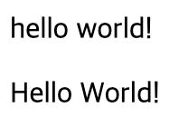
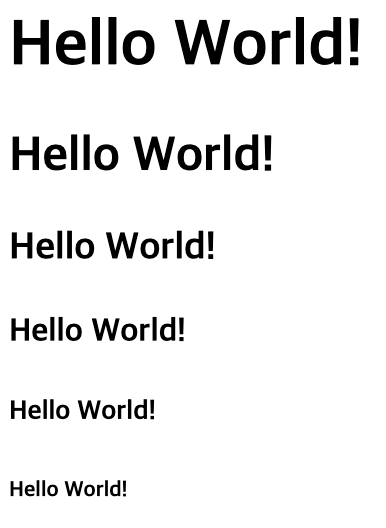
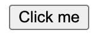

# React 기초 강의  
### Component, State, Props
\~ by tunalee

---

# React란?
- **React**는 Facebook에서 개발한 **UI 라이브러리**.
- **컴포넌트 기반**으로 웹 애플리케이션을 효율적으로 개발 가능.
- **Virtual DOM**을 사용해 빠른 업데이트와 렌더링을 제공.
---

# Node 설치 (https://nodejs.org/en)


---
# Node version 확인
```
$ node -v
```


---

# React 프로젝트 생성

**npx**를 사용해 React 프로젝트 생성:

```bash
$ npx create-react-app my-app
```

```bash
$ cd my-app
```
```bash
$ npm start
```
---

# npm이란?
- **Node Package Manager**의 약자.
- 자바스크립트 라이브러리 및 패키지를 관리하는 도구.
---

# package.json이란?
- 프로젝트의 **정보와 의존성**을 관리하는 파일.

```json
{
  "name": "my-app",
  "version": "0.1.0",
  "dependencies": {
    "react": "^18.0.0",
    "react-dom": "^18.0.0"
  },
  "scripts": {
    "start": "react-scripts start",
    "build": "react-scripts build"
  }
}
```
---
# package.json 주요 항목
- **name**: 프로젝트 이름
- **version**: 프로젝트 버전
- **dependencies**: 프로젝트에서 사용하는 **외부 라이브러리** 목록
- **scripts**: npm 명령어를 등록하여 **자동화** 작업 가능

```bash
npm start   
npm build   
npm install 
```

---
# React 프로젝트 구조

```bash
my-app/
├── node_modules/
├── public/
├── src/
│   ├── App.js
│   ├── index.js
│   └── ...
├── package.json
└── README.md
```

---


---

# React Component란?
- UI를 구성하는 독립적인 **재사용 가능 단위**.
- 함수형 컴포넌트와 클래스형 컴포넌트로 나뉨.

```js
function Hello() {
  return <div>Hello, World!</div>;
}
```

```js
const Hello = () => {
    return (
        <div>Hello World!</div>
    )
}
```

---

# React Component의 특징
- **독립성**: 각 컴포넌트는 자신의 상태와 동작을 가짐.
- **재사용성**: 다양한 곳에서 동일한 컴포넌트를 재사용 가능.
- **계층 구조**: 컴포넌트는 다른 컴포넌트를 포함할 수 있음.

---

# React 기본 태그 소개

## 개요
React에서 주로 사용하는 태그들과 그 역할을 설명합니다.

---
# <div> 태그
- 일반적인 HTML의 div 태그와 동일
- 여러 컴포넌트를 감싸거나 레이아웃을 나누는 용도로 사용됩니다.
```
function Hello() {
  return (
    <div>
      <div>hello world!</div>
      <div>Hello World!</div>
    </div>
  );
}
```


---
# <p> 태그
- 단락을 나타내는 p 태그.
- 일반 텍스트나 설명을 포함할 때 사용합니다.
```
function Hello() {
  return (
    <div>
      <p>hello world!</p>
      <p>Hello World!</p>
    </div>
  );
}
```


---
# <h1> ~ <h6> 태그
- 헤딩 태그로, 각각 다른 수준의 제목을 나타냅니다.
- h1이 가장 크고 중요한 제목, h6이 가장 작고 덜 중요한 제목입니다.
```
function Hello() {
  return (
    <div>
      <h1>Hello World!</h1>
      <h2>Hello World!</h2>
      <h3>Hello World!</h3>
      <h4>Hello World!</h4>
      <h5>Hello World!</h5>
      <h6>Hello World!</h6>
    </div>
  );
}
```
---


---
# <button> 태그
- 클릭 이벤트를 처리하기 위해 사용합니다.
- React에서 클릭 이벤트 핸들러를 등록할 수 있습니다.

```
function Button() {
  return (
    <button onClick={() => alert('Button clicked!')}>
      Click me
    </button>
  );
}
```


---

